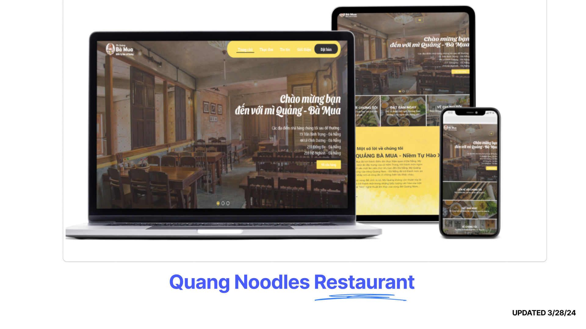
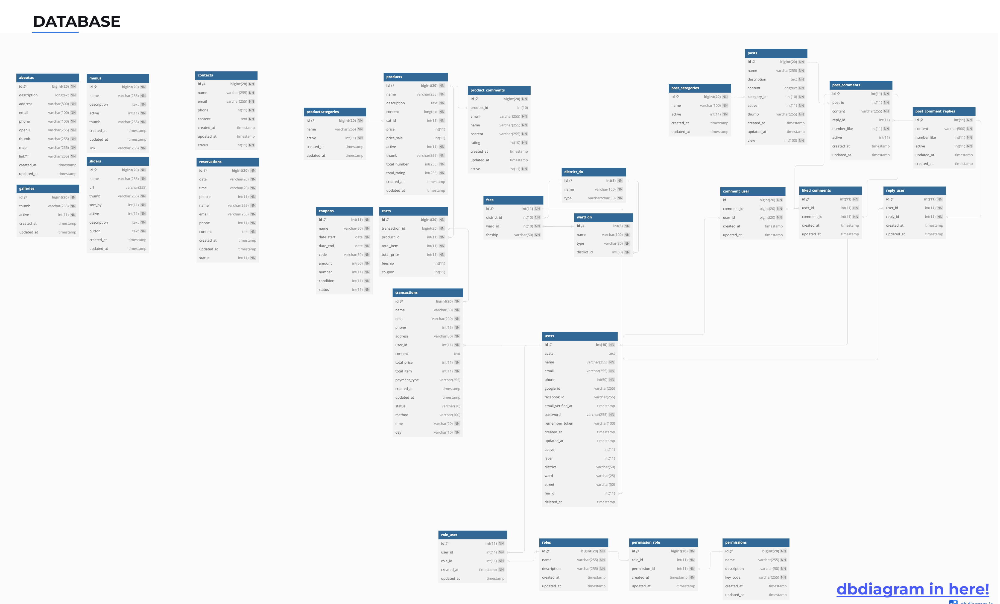
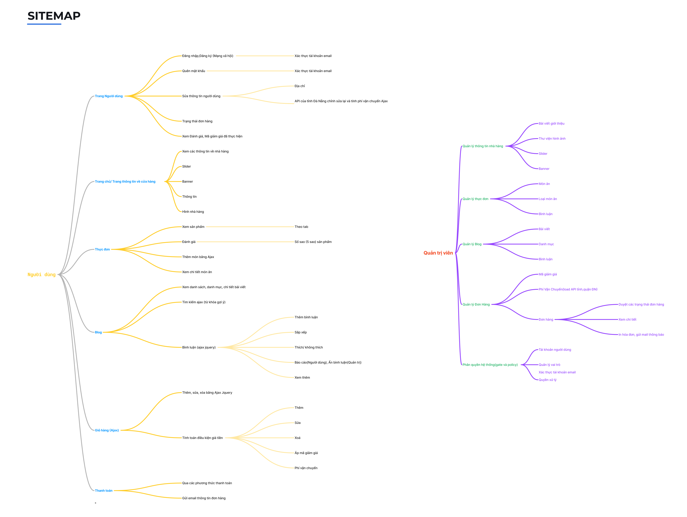
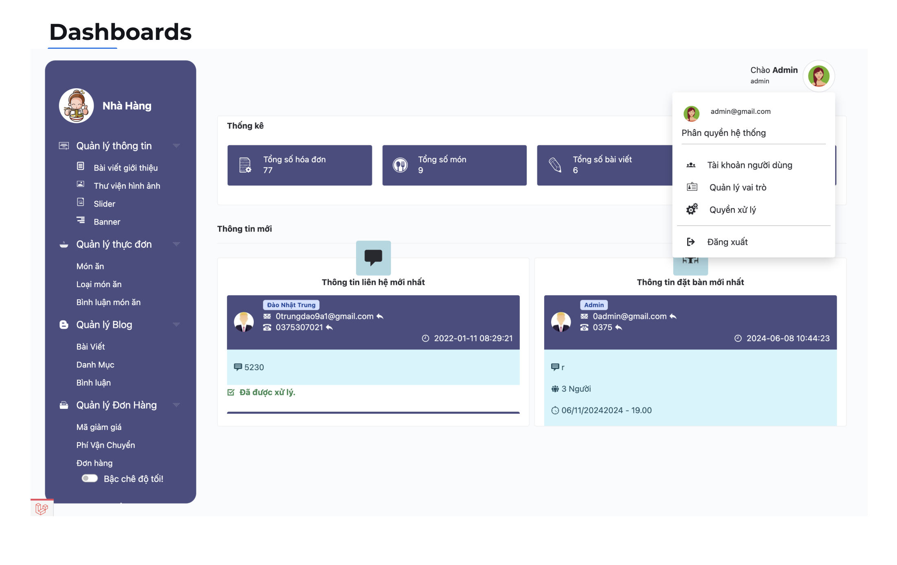

 
# Introduce

## DEMO: 
* Video demo: https://youtu.be/X7CEoBDfQoU
* Images, Database, report, Source code
   * If error: https://s.net.vn/M7qj
## Technology used:
* Backend: PHP(Laravel)
* Frontend: HTML, CSS, JS(Ajax jQuery)
* Database: MySQL
## Database

## Instructions for installation and error correction
* `composer update`
* Fix no image error:
  * Download the missing image file: https://s.net.vn/M7qj
  * Delete folder `public->storage`
  * Run Terminal: `php artisan storage:link`
## Site Map

# Functions and Pages:
## User Page
* Login, Register (Social Network)
  * Verify email account
* Forgot password
  * Verify email account
* Edit user information
  * Address
    * Da Nang province's API revises and calculates Ajax shipping fees
* Order status
* View Reviews, Discount Codes implemented.

## Home page/About us
* Information about the restaurant
* Slider
* Banner
* image gallery

## Menu
* View products
  * by tab
* Add product using Ajax
* View product details
  * Rating (5 stars)

## Cart (AJAX)
* Add, edit, and delete with Ajax JQuery.
* Calculate price conditions when: Add, Edit, Delete, Apply discount code, Shipping fee.
## Pay
* Update order status
* Email order information to customers
## Blog
* View list, categories, article details
* Search (suggested keywords)
* Comment (AJAX)
  * Add comments
  * Arrange
    * newest or most prominent.
  * Like/dislike
  * Report (User), Hide comments (Admin)
  * Load more comments
## Reservation
* Add to DB and send a confirmation email.
## Administrators

### Restaurant information management.
  * Introductory article
  * Image galleries
  * Sliders
  * Banners
### Menu management
  * Products
  * Categories
  * Reviews
### Blog Management
  * Posts
  * Categories
  * Comments
### Order Management
  * Discount code
  * Shipping Fee (API province, Da Nang district)
  * Order
    * Browse order status
    * View details (Print invoice, send notification email)
### Decentralization (gate and policy)
  * Users account
  * Roles management
  * Processing rights
#                                         Thank you for scrolling this far!!

